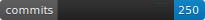
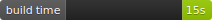
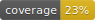

# Sparkbadge 


Sparkbadges is a tool for create longitudinal status sparklines for your projects. For example:


The sparkline SVGs you create can then be implemented in a badge using a tool such as [google/pybadges](https://github.com/google/pybadges):




Sparkbadges was heavily influenced and inspired by [google/pybadges](https://github.com/google/pybadges) and the aesthetics of the [Shields.io](https://github.com/badges/shields) project.

## Usage

```
usage: sparkbadge [-h] [-o OWNER] [-r REPO]
                  [-s {loc,coverage,deps,commits,issues,pr,wf_runs}] [-d DIR]

Generate sparklines for your status badge.

options:
  -h, --help            show this help message and exit
  -o OWNER, --owner OWNER
                        The repository owner.
  -r REPO, --repo REPO  The repository.
  -s {loc,coverage,deps,commits,issues,pr,wf_runs}, --sparkline {loc,coverage,deps,commits,issues,pr,wf_runs}
                        The sparkline to use.
  -d DIR, --dir DIR     The directory to store sparkbadges. Default is
                        .sparkbadge/
```

## Development Roadmap

Check out the [project outline](docs/outline.md) to learn more.

## Test Action

*Remove later, for testing purposes only!*


