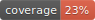

# Sparkbadge 


Sparkbadges is a tool for create longitudinal status sparklines for your projects. For example:


The sparkline SVGs you create can then be implemented in a badge using a tool such as [google/pybadges](https://github.com/google/pybadges):


Sparkbadges was heavily influenced and inspired by [google/pybadges](https://github.com/google/pybadges) and the aesthetics of the [Shields.io](https://github.com/badges/shields) project.

## Usage

```
usage: sparkbadge [-h] [-u UEP] [-t TIMEFRAME] [-m {commits,issues}] [-s SOURCE] [-d DIR]

Generate sparklines for your status badge.

options:
  -h, --help            show this help message and exit
  -u UEP, --uep UEP     The ID or URL-encoded path of the project.
  -t TIMEFRAME, --timeframe TIMEFRAME
                        The timeframe to create sparklines over, inclusive. Format (start year to end year) is "YYYY-YYYY". An example input would be "
                        --timeframe 2017-2020". Currently only years are supported.
  -m {commits,issues}, --metrics {commits,issues}
                        The sparkline to use.
  -s SOURCE, --source SOURCE
                        The source forge (i.e. github or gitlab).
  -d DIR, --dir DIR     The directory to store sparkbadges. Default is .sparkbadge/
```

## Development Roadmap

Our goal is to have a completely platform-independent way to create sparklines for your status badges.

Check out the [project outline](docs/outline.md) for a detailed roadmap of planned features.

### CLI Tooling

Create longitudinal sparklines, and easily integrate them with status badges.

```sh
# Example: commits sparkline (year-to-day)
$ python -m sparkbadge -u klauefer/sparkbadge -m commits
# Outputs a base64-encoded image
>>> data:image/svg+xml;base64,PD94bWwg...

# Pipe the base64-encoded image to pybadges
$ python -m sparkbadge -u klauefer/sparkbadge -m commits \
    | xargs -I {} python -m pybadges --right-image "{}"
```

### Hosting With Post-Commit Hooks

One of the biggest draws of sparkbadge is its ability to integrate right into your project. Simply run `sparkbadge init` inside a git repository to get started.

```sh
$ sparkbadge init

# Creates a .sparkbadge hidden directory with spark.yml config file inside
# See the next section for editing spark.yml
$ ls .sparkbadge
>>> spark.yml

# Also generates a post-commit action workflow
$ ls .github/workflows/sparkbadge.yml
```

The action workflow `sparkbadge.yml` runs on every push and adds the most up-to-date metrics to your project. 

### Easily Extensible

The `spark.yml` file is used to standardize data across multiple sources. It "describes" where the desired metrics can be found in each API. 

If there is hosting service or metric that you feel is missing, no problem! Simply edit the to `spark.yml`.

Documentation on editing `spark.yml` can be found [here](docs/extending-sparkbadge.md).


## Test Action

*Remove later, for testing purposes only!*



