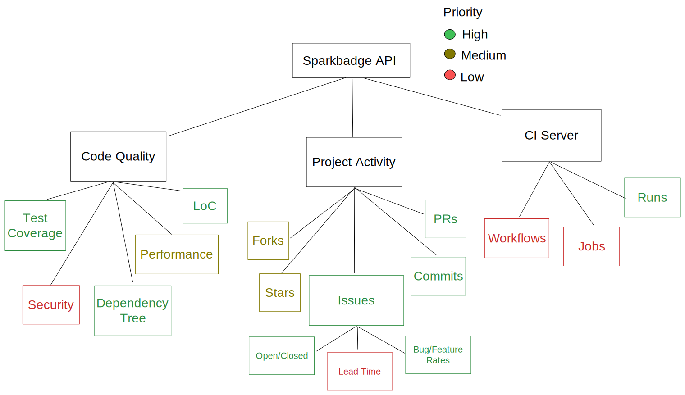

# Notes

## Protocol Layers

1) Repo hosting (GitHub, GitLab, bitbucket, sourcehut, custom?)
2) CI servers (Actions, GitLab CI, Circle, Travis, etc.
3) App/Protocol (Handles the SVG creation)

- Protocol spec:
    - Our API should be able to handle the above layers interchangeably 
    - Should allow for easy creation of new longitudinal metrics
    - Split into 3 areas:
        - Code quality 
        - Project activity 
        - CI server metrics
    - Hosted **on** a CI service like gh actions, or on cloud
- Hosting:
    - On gh actions, add a workflow to run sparkbadge script triggered by a commit/some other action
    - Cache badges in `.sparkbadge/` 
    - Look into hosting solutions (AWS, Azure, fly.io)
- Goals:
    - Add to `pip`?

## Diagram

